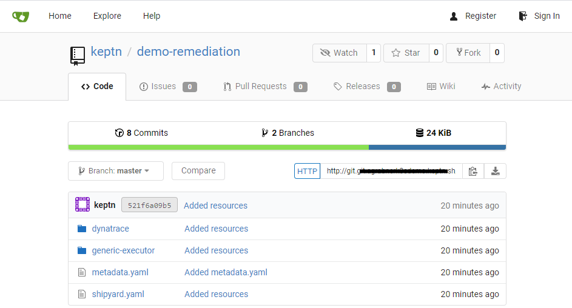
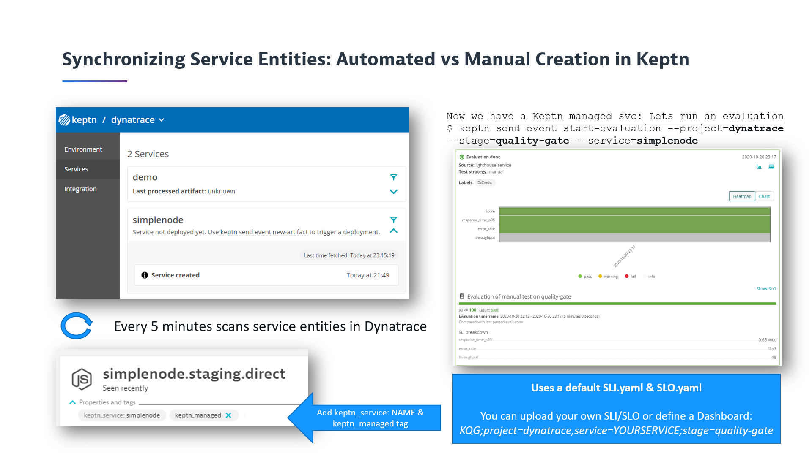
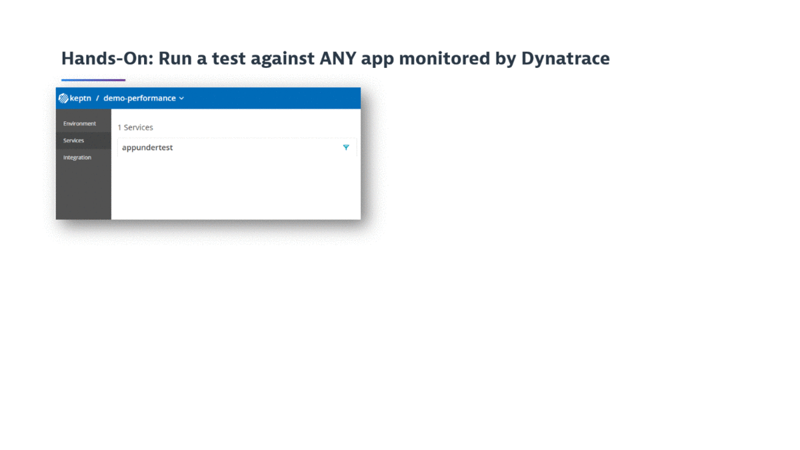
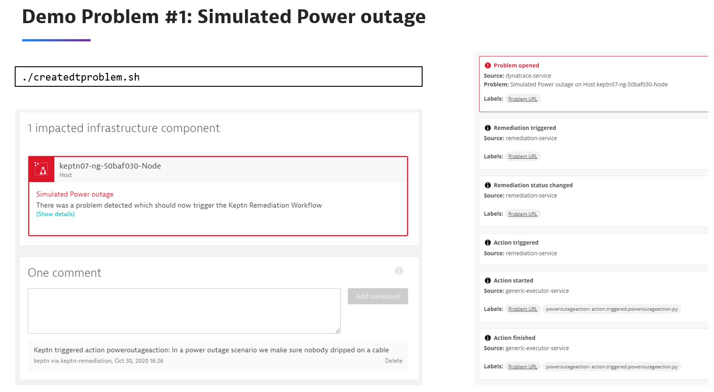
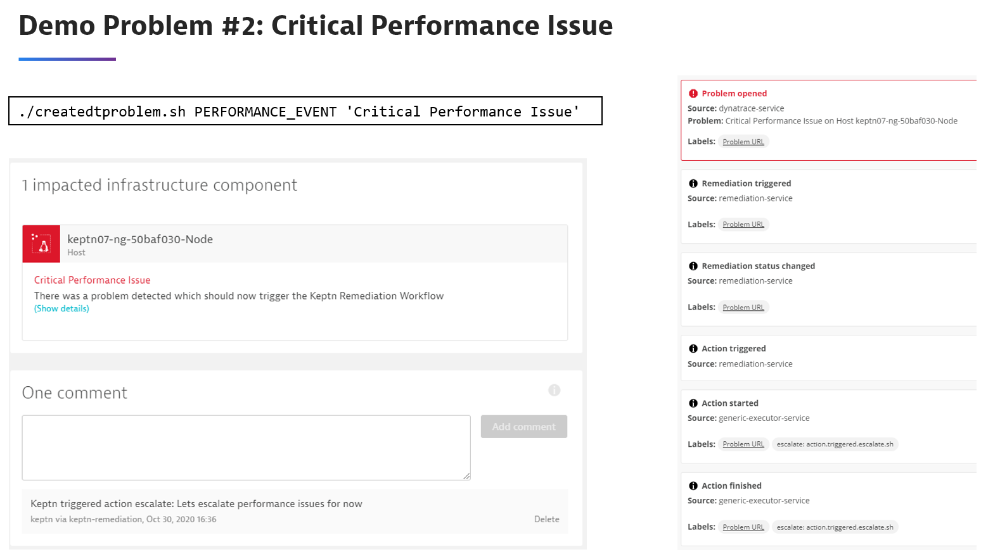

# Keptn for Dynatrace Users in 5 Minutes

ATTENTION: This tutorial has recently been updated for Keptn 0.8.x and it added a couple of new use cases, e.g: Canary Deployments with Argo Rollout
This description is not yet fully updated with all the latest. The best way to get started is just following the instructions on the main [README.md](README.md)


If you follow this installation guide you will be able to explore the key Keptn use cases with Dynatrace:
* SLI/SLO Based Quality Gates
* Performance as a Self-Service
* Auto-Remediation

**Watch these tutorial on YouTube:** 
* [SLO-based Quality Gates with Keptn & Dynatrace in 5 Minutes](https://www.youtube.com/watch?v=650Gn--XEQE)
* [SRE-Driven Auto Remediation with Keptn & Dynatrace in 5 minutes](https://www.youtube.com/watch?v=05Mzs-Donr0)
* [Performance Analysis Automation with JMeter, Keptn & Dynatrace in 5 Minutes](https://www.youtube.com/watch?v=m4dkR8QxYSE&list=PLqt2rd0eew1YFx9m8dBFSiGYSBcDuWG38&index=6&t=1s)

For Dynatrace users this script installs Dynatrace related Keptn services (`--with-dynatrace`) and connects them to your Dynatrace Tenant (SaaS or Managed). 
It also gives you the option (`--with-demo dynatrace`) to create your first Keptn Dynatrace Demo projects so you can immediatly explore how Quality Gates, Performance as a Self-Service and Auto-Remediation Use Cases work with Keptn & Dynatrace.

## Four Pre-Requisits

### 1 - Dynatrace Credentials

For enabling Dynatrace support we need to export DT_TENANT & DT_API_TOKEN so that Keptn can connect to your Dynatrace Tenant! More details on the [Keptn doc](https://keptn.sh/docs/0.7.x/monitoring/dynatrace/install/)

When installing the Dynatrace Demos you also need to export OWNER_EMAIL and set it to a valid Dynatrace Username identified by the email. This is needed because the demos will install some Dynatrace dashboards and for those we need the username. Best is to use the same email that was used to create the Dynatrace token!

### 2 - Public IP or Host Name

The script will try to fetch your machines IP or Hostname. If you run on AWS, GCP or DigitalOcean you can specify the (`--provider aws|gcp|digitalocean`) option to let the script use some documented APIs to query the public IP.

You can also specify the public IP via (`--ip YOURIP`).

If you do have an FQDN (Full Qualified Domain Name) for your host you should pass it in via (`--fqdn yourdomain.abc`).

### 3 - Certifcate & k3s accessible from Dynatrace

For the Auto-Remediation Use Case to work Dynatrace needs to be able to send problem notifications to your Keptn. This means your Keptn installation must be accessible from your Dynatrace Tenant (SaaS or Managed) and it must have an SSL certificate issued for your hostname/FQDN. The installation script either allows you to specifiy your own FQDN (Full Qualified Domain Name) via (`--fqdn yourdomain.abc`) or it can use your machines IP and leverage the service *xip.io* to get a DNS such as YOURIP.xip.io. 

**Caution:** While xip.io is a good demo option it is not 100% reliable! A better option is to create your own DNS entry to point to your machine and then specify it via the (`--fqdn yourdomain.abc`)

Good news is that the script provides the option (`--letsencrypt`) which creates a self-signed certificate for either your 1.2.3.4.xip.io or your FQDN. If you want to use letsencrypt we need to export the environment variables LE_STAGE=staging and CERT_EMAIL=someemail

### 4 - Your host needs to allow HTTP/HTTPS incoming traffic

The host you install Keptn on should be accessible via HTTPS. So - if you create an EC2 or GCP instance - please make sure that HTTP (80) & HTTPS (443) are enabled for inbound traffic. Otherwise installation will not work, e.g: letsencrypt wont issue or certificate or Dynatrace wont be able to call into your Keptn instance

## Installation including 6 Demo Projects

Let's first export all relevant environment variables we need:
```console
$ export DT_TENANT=abc12345.live.dynatrace.com        # Host name of your Dynatrace Tenant
$ export DT_API_TOKEN=YOURTOKEN                       # Dynatrace API token to let Keptn pull SLIs from Dynatrace
$ export DT_PAAS_TOKEN=YOURPAASTOKEN                  # Dynatrace PAAS token as script will install OneAgent
$ export OWNER_EMAIL=yourdynatraceuser@yourmail.com   # Your username in Dynatrace
$ export LE_STAGE=staging                             # This is needed for certificate creation
```

**Option 1:** Install with xip.io domain and self-signed certificate

You see that the sample uses the `--with-demo dynatrace`, `--letsencrypt` and `--provider aws` option:
```console
$ ./install-keptn-on-k3s.sh --delivery-plane --provider aws --with-dynatrace --with-demo dynatrace --letsencrypt --with-gitea
``` 

All URLs provided will be of form http(s)://keptn.12.23.34.45.xip.io. xip.io is a free DNS resolution service which will resolve any DNS request to that IP Address as part of the DNS name.

**Option 2:** Use your own custom domain that points to your host
You see that the sample additionally uses the `--fqdn mykeptn.mydomain.com` option:
```console
$ ./install-keptn-on-k3s.sh --delivery-plane --provider aws --with-dynatrace --with-demo dynatrace --letsencrypt --with-gitea --fqdn mykeptn.mydomain.com
``` 

All URLs provided will be of form http(s)://keptn.YOURDOMAIN. So - when setting up your own custom domain name make sure that you have a wildcard route so that all subdomains from your FQDN will also map to your machine where you install Keptn on k3s.


Installation will take about 4-5 minutes assuming there are no issues with getting a certifcate, you have enough resources, ...
In case you run into an issue - simply try it again. If you still have an issue - ping us on the [Keptn Slack](https://slack.keptn.sh)

. Once its done you see a console output similiar to this:
```console
#######################################>
# Keptn Deployment Summary
#######################################>
API URL   :      https://keptn.12.23.34.45.xip.io/api
Bridge URL:      https://keptn.12.23.34.45.xip.io/bridge
Bridge Username: keptn
Bridge Password: BRIDGEPASSWORD
API Token :      KEPTN_API_TOKEN
Git Server:      http://git.12.23.34.45.xip.io
Git User:        keptn
Git Password:    keptn#R0cks


#######################################>
# Dynatrace Demo Summary: 6 Use Cases to explore
#######################################>
6 Dynatrace Demo projects have been created, the Keptn CLI has been downloaded and configured and a first demo quality gate was already executed.

For the Quality Gate Use case you can do this::
1: Open the Keptn's Bridge for your Quality Gate Project:
   Project URL: https://12.23.34.45.xip.io/bridge/project/dynatrace
   User / PWD: keptn / BRIDGEPASSWORD
2: Run another Quality Gate via:
   keptn trigger evaluation --project=dynatrace --stage=quality-gate --service=demo
3: Automatically synchronize your Dynatrace monitored services with Keptn by adding the 'keptn_managed' and 'keptn_service:SERVICENAME' tag
   More details here: https://github.com/keptn-contrib/dynatrace-service#synchronizing-service-entities-detected-by-dynatrace

For the Performance as a Self-Service Demo we have created a project that contains a simple JMeter test that can test a single URL.
Here are 3 things you can do:
1: Open the Keptn's Bridge for your Performance Project:
   Project URL: https://12.23.34.45.xip.io/bridge/project/demo-performance
   User / PWD: keptn / BRIDGEPASSWORD
2: In Dynatrace pick a service you want to run a simple test against and add the manual label: appundertest
3: (optional) Create an SLO-Dashboard in Dynatrace with the name: KQG;project=demo-performance;service=appundertest;stage=performance
4: Trigger a Performance test for an application that is accessible from this machine, e.g. http://yourapp/yoururl
   ./senddeployfinished.sh demo-performance performance appundertest performance_withdtmint http://yourapp/yoururl
5: Watch data in Dynatrace as the test gets executed and watch the Quality Gate in Keptn after test execution is done!

For the Auto-Remediation Demo we have created project demo-remediation that contains a default remediation.yaml and some bash and python scripts
In order for this to work do
1: Create a new Problem Notification Integration as explained in the readme
2: Either force Dynatrace to open a problem ticket, create one through the API or execute createdtproblem.sh
3: Watch the auto-remediation actions in Keptn's bridge
   Project URL: https://12.23.34.45.xip.io/bridge/project/demo-remediation
   User / PWD: keptn / BRIDGEPASSWORD

Explore more Dynatrace related tutorials on https://tutorials.keptn.sh

If you want to install the Keptn CLI somewhere else - here the description:
- Install the keptn CLI: curl -sL https://get.keptn.sh | sudo -E bash
- Authenticate: keptn auth  --api-token "KEPTN_API_TOKEN" --endpoint "https://12.23.34.45.xip.io/api"

If you want to uninstall Keptn and k3s simply type: k3s-uninstall.sh!
After that also remove the demo files that were downloaded in your local working directory!

Now go and enjoy Keptn!
```

## Accessing Keptn projects and configuration files

If you have used the `--with-gitea` option the installation script not only installed Gitea (a Git Service) but also created Git repositories and set them as upstream git repos for each created keptn project via `keptn update project --git-xxxx`
Now - if you have not used that option but if you have your own Git account on either GitHub, Bitbucket, GitLab, Azure ... then you can simply update each keptn project and point it to your own upstream gits. More information on that can be found here: [Git-based upstream](https://keptn.sh/docs/0.7.x/manage/git_upstream/)

Here is the overview of the created Keptn Projects:


If you have the Git-upstream you can simply click on that link and it brings you to your git-upstream repo. Thats a great way to learn how Keptn organizes its configuration files in Git. You will see the main branch with the shipyard.yaml as well as the stage specific branches with stage and service specific files:




## Use Case 1: Quality Gate

**Watch this Use Case on YouTube:** [SLO-based Quality Gates with Keptn & Dynatrace in 5 Minutes](https://www.youtube.com/watch?v=650Gn--XEQE&list=PLqt2rd0eew1YFx9m8dBFSiGYSBcDuWG38&index=4&t=2s)

So - for the quality gate use case there is already a project created called *dynatrace*. A first quality gate evaluation was already triggered during the installation so you should already see the first results. If you want you can also run a couple more quality gate evaluation using the keptn CLI command shown in the output:
```console
keptn trigger evaluation --project=dynatrace --stage=quality-gate --service=demo
```

Here is how this should look like in your Keptn's Bridge:


When you click the dashboard link that is shown as a label in the *Evaluation done* event you get to the Dynatrace SLO Dashboard that is linked to this Keptn project:


From here on you can either modify the dashboard to add more SLIs, or you can run more quality gate evaluations:

You can also use this project to let Keptn manage any of your application services Dynatrace is currently monitoring. This is possible through the built-in synchronization option:


## Use Case 2: Performance as a Self-Service

**Watch this Use Case on YouTube:** [SLO-based Quality Gates with Keptn & Dynatrace in 5 Minutes](https://www.youtube.com/watch?v=650Gn--XEQE&list=PLqt2rd0eew1YFx9m8dBFSiGYSBcDuWG38&index=4&t=2s)

The demo comes with a project called *demo-performance* which has been pre-loaded with a basic JMeter script that can execute requests against ANY URL. This can be used for demo purposes to show how Keptn can orchestrate the execution of a test against any monitored service and then evaluate SLI/SLO-based quality gates.

All you need to do is put a tag on one of your services in Dynatrace called *appundertest* and then use the script *trigger.performance.testing.sh* and giving it the URL of that service endpoint. Then wait for the results!



## Use Case 3: Auto-Remediation

**Watch this Use Case on YouTube:** [Automated Problem Remediation with Keptn & Dynatrace in 5 Minutes](https://www.youtube.com/watch?v=05Mzs-Donr0&list=PLqt2rd0eew1YFx9m8dBFSiGYSBcDuWG38&index=7)

This demo allows you to have Keptn react to ANY or SOME problems that Dynatrace detects by executing a remediation workflow. The remediation workflow will execute either a Python script, bash script or can execute an HTTP webhook. 

For this example we need to
1: Create a Dynatrace Problem Notification to send ALL/SOME Events from Dynatrace to our *demo-remediation* Keptn project
2: (optionally) Simulate an problem event

### Create Problem Notification in Dynatrace

Lets create a simple Webhook Problem Notification in Dynatrace with the following values:
* Webhook URL: `YOURKEPTNDOMAIN/api/v1/event`
* Header x-token: `YOURKEPTNAPITOKEN`
* Header Content-Type: `application/cloudevents+json`
Payload:
```json
{
    "specversion":"0.2",
    "shkeptncontext":"{PID}",
    "type":"sh.keptn.events.problem",
    "source":"dynatrace",
    "id":"{PID}",
    "time":"",
    "contenttype":"application/json",
    "data": {
        "State":"{State}",
        "ProblemID":"{ProblemID}",
        "PID":"{PID}",
        "ProblemTitle":"{ProblemTitle}",
        "ProblemURL":"{ProblemURL}",
        "ProblemDetails":{ProblemDetailsJSON},
        "Tags":"{Tags}",
        "ImpactedEntities":{ImpactedEntities},
        "ImpactedEntity":"{ImpactedEntity}",
        "KeptnProject":"demo-remediation",
        "KeptnService":"default",
        "KeptnStage":"production"
    }
}
```
Select the best alerting profile and then hit *Send test notification*. This should send an event to Keptn which seconds later you should also see in Keptn's demo-remediation project. It will also kick off the default remediation workflow which just executes a simple bash script that echos some data!
If the Dynatrace UI tells you that something is not working it is most likely that your Dynatrace Tenant cannot reach your Keptn. This is why we mentioned in the beginning that your machine needs to be accessible from your Dynatrace Tenant (SaaS or Managed)

**How does this map to a Keptn Project?**

They way the mapping works is based on the information in the "Tags" string. You can see that there we reference the Keptn Project, Stage & Service. This information is used by Keptn to map incoming problems to a Keptn Project, Stage and Service where it then looks for the remediation.yaml!

### Simulate some problems

If your Dynatrace environment detects problems on a regular basis then you are already set and can start watching how Keptn will execute remediation workflows.
If you however just do this in a demo environment where you don't have new problems come in all the time we can use the *createdtproblem.sh* script to simulate some problems. What this script needs is a Dynatrace Entity ID it can send a problem event to. The best is if you pick any Dynatrace HOST Entity, e.g: HOST-ABCD123123AD. Navigate to one of your hosts and copy it from the URL. Now we export this value via DT_ENTITY_ID

**Demo Problem 1: Power outage**
```console
export DT_ENTITY_ID=HOST-YOURHOSTENTITYID
./createdtproblem.sh
```



**Demo Problem 2: Critial Performance Issue**
```console
./createdtproblem.sh PERFORMANCE_EVENT 'Critical Performance Issue'
```



### Remediation.yaml & Scripts

Check out the [remediation.yaml](./files/remediation.yaml) that this sample uses to make yourself familiar with remediation workflows in Keptn.
This demo also uses the [generic-executor-service that allows](https://github.com/keptn-sandbox/generic-executor-service/) you to execute any type of Python, Bash or HTTP script. You can find all the scripts either in this repo under [files](./files) or on your keptn k3s machine in the keptn folder!

## Use Case 4: Multi-Stage Delivery with Blue/Green (using Istio)
Please follow the instructions in the output of the installations script.

## Use Case 5: Canary Rollouts with Argo
This is a rather new use case using Argo Rollouts for a Production Canary Rollout. As it leverages the Argo Rollout integration and the Helm Service capability to deploy a "user_managed" helm chart we can currently not use the keptn cli to trigger a deployment but we have to send in the trigger event through the Keptn API.

### Deploy Version 1

If you have installed Gitea then you can navigate to your Git repository for the delivery-rollout project. In the main branch you will find a file called `prod.deployment.triggered.json`. Take this and post it via the Keptn Swagger API as an Event. It will trigger the delivery of the first build of the simplenode app
You can watch it in the bridge. Keptn will first deploy the helm chart of version 1. As this is the first deployment it will immediately go out to 100% canary coverage. For that reason you can also stop the rollout when you are asked as part of the first approval. We are all set now!

### Deploy Version 2

First we need to update our version to 2.0.0 in the helm chart. Therefore navigate to the Gitea repository. Navigate to the prod branch and there into simplenode/helm/simplenode. Edit the values.yaml and change the version to 2.0.0.
Now we can trigger another deployment just as we did for Version 1 by sending an event to Keptn via the Keptn API. This will now force Keptn to first deploy the rollout changes for 2.0.0 which will result in the first rollout step of 25%. After tests are run you have an approval if you want to continue the rollout. You can now approve this and watch the next steps as the rollout continues with 50 to 75 and finally 100% coverage

### Deploy Version 3 & 4

You can repeat the same steps for version 3 & 4

## Use Case 6: Advanced Performance Testing


## Cleanup: Uninstall k3s
```console
k3s-uninstall.sh
```

After that lets also clear the downloaded sample files in your local working directory!