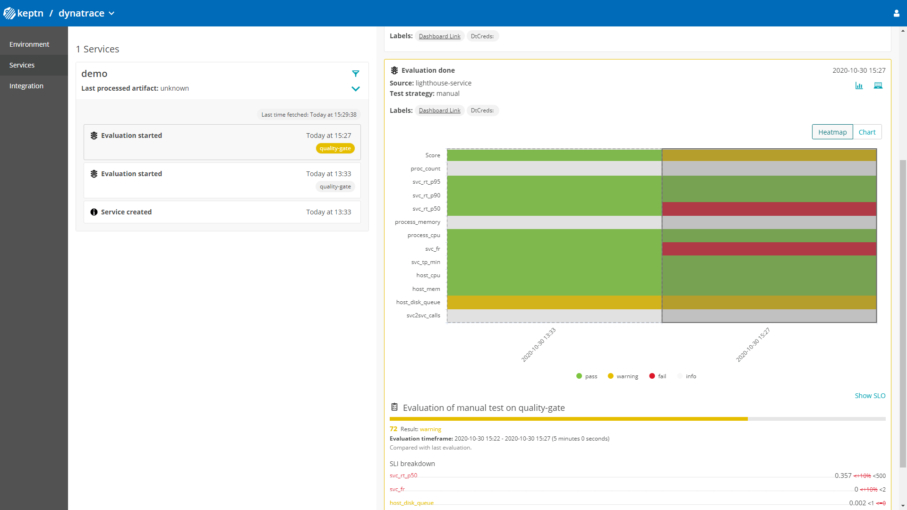
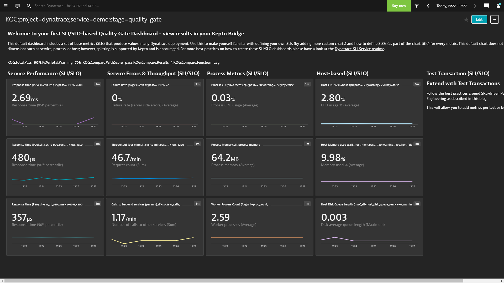

# Keptn Control Plane on k3s

Installs [Keptn's](https://keptn.sh) Control Plane on [k3s](https://k3s.io) which is your fastest and easiest way to leverage Keptn for SLI/SLO-based Quality Gates, Performance as a Self-Service and Automated Operation (aka Auto-Remedition).

Keptn Control Plane includes Keptns Bridge, API and the Quality Gate capability and optionally the JMeter service! But does _not_ include capabilities for using Keptn as deployment tool.

The install scripts provides with the additional options to configure either Prometheus or Dynatrace support automatically as well as installing the JMeter service to enable the Performance as a Self-Service capability!

On top of that you are free to install any other Keptn Service such as the Notification, Jenkins, Grafana, Jira ... service. Find those services in the [Keptn-Contrib](https://github.com/keptn-contrib) organization.

## Use cases, pre-requisites and supported stacks

If you want to watch our Keptn on k3s webinar [click here!](https://www.youtube.com/watch?v=hx0NHj4u7ic)

### Use Case
 * You want to try out keptn
 * You don't want to deal with Kubernetes
 * You have access to a Linux host
 
### But:
 * You don't want to use this in production (currently)
 * You don't plan to upgrade this installation (currently, but maybe reinstall) 

### Prerequisites:
  * A machine which is able to execute bash scripts
  * curl
  
### Currently tested on:
  * CentOS 8
  * ArchLinux
  * Debian on GCP
  * Amazon Linux 2
  
* Works on a machine with 1 (v)CPU and 4GB of memory

### Parameters
The script allows a couple of parameters
| Parameter Name | Values | Comment |
| ------------------------------ | ------ | --------|
| `--with-prometheus` | | Will enable Prometheus Support |
| `--with-dynatrace` | | Will enable Dynatrace Support.<br>Requires DT_API_TOKEN, DT_PAAS_TOKEN and DT_TENANT env variables to be set |
| `--with-jmeter` | | Will install JMeter Service |
| `--with-slackbot` | | Will install the Keptn slackbot. <br> Requires SLACKBOT_TOKEN env variable to be set |
| `--use-xip` | | Will use a xip.io domain, will also be added when LE_STAGE=staging is selected |
| `--provider` | aws<br>gcp<br>digitalocean<br>EMPTY | handles IP gathering based on provider or uses hostname in case its empty |
| `--ip` | YOURIP | Allows you to pass your own IP of your host |
| `--fqdn` | YOURFQDN | Allows you to pass your own hostname, allows you to create production LetsEncrypt Certificates, You need to create your own DNS entry |
| `--with-demo` | dynatrace | Will install demo projects for Dynatrace |


### TLS Certificates
keptn-on-k3s comes with [cert-manager](https://cert-manager.io/). By default, a self-signed certificate is generated. By adding `--letsencrypt` as a parameter, and a CERT_EMAIL is exported, you will create a LetsEncrypt-Staging certificate. By additionally exporting `LE_STAGE=production`, a LetsEncypt Production certificate will be issued (will not work with xip.io and nip.io). 

## Keptn for Dynatrace Users in 5 Minutes

For Dynatrace users the script installs Dynatrace related Keptn services (`--with-dynatrace`) and connects them to your Dynatrace Tenant (SaaS or Managed). 
It also gives you the option (`--with-demo dynatrace`) to create your first Keptn Dynatrace Demo projects so you can immediatly explore how Quality Gates or Performance as a Self-Service works with Keptn & Dynatrace.

**Pre-Requisit:** For enabling Dynatrace support you must first export DT_TENANT & DT_API_TOKEN so that Keptn can connect to your Dynatrace Tenant!
**--provider:** Depending on your virtual machine either specify aws, gcp, digitalocean or remove that parameter if you run this on any other supported linux!

```console
$ export DT_TENANT=abc12345.live.dynatrace.com
$ export DT_API_TOKEN=YOURTOKEN
$ curl -Lsf https://raw.githubusercontent.com/keptn-sandbox/keptn-on-k3s/dynatrace-support/install-keptn-on-k3s.sh | bash -s - --provider aws --with-dynatrace --with-jmeter --with-demo dynatrace
``` 

It takes about 2-3 minutes. Once its done you see a console output similiar to this:
```console
#######################################>
# Keptn Deployment Summary
#######################################>
API URL   :      https://12.123.77.189/api
Bridge URL:      https://12.123.77.189/bridge
Bridge Username: keptn
Bridge Password: BRIDGEPASSWORD
API Token :      KEPTNAPITOKEN

#######################################>
# Dynatrace Demo Summary
#######################################>
The Dynatrace Demo projects have been created, the Keptn CLI has been downloaded and configured and a first demo quality gate was already executed.
Here are 3 things you can do:
1: Open the Keptn's Bridge for your Quality Gate Project:
   Project URL: https://12.123.77.189/bridge/project/dynatrace
   User / PWD: keptn / BRIDGEPASSWORD
2: Run another Quality Gate via:
   keptn send event start-evaluation --project=dynatrace --stage=qualitygate --service=qualitygateservice
3: Automatically synchronize your Dynatrace monitored services with Keptn by adding the 'keptn_managed' and 'keptn_service:SERVICENAME' tag
   More details here: https://github.com/keptn-contrib/dynatrace-service#synchronizing-service-entities-detected-by-dynatrace

For the Performance as a Self-Service Demo we have created a project that contains a simple JMeter test that can test a single URL.
Here are 3 things you can do:
1: Open the Keptn's Bridge for your Performance Project:
   Project URL: https://12.123.77.189/bridge/project/demo-performance
   User / PWD: keptn / BRIDGEPASSWORD
2: In Dynatrace pick a service you want to run a simple test against and add the manual label: appundertest
3: (optional) Create an SLO-Dashboard in Dynatrace with the name: KQG;project=demo-performance;service=appundertest;stage=performance
4: Trigger a Performance test for an application that is accessible from this machine, e.g. http://yourapp/yoururl
   ./senddeployfinished.sh demo-performance performance appundertest performance_withdtmint http://yourapp/yoururl
5: Watch data in Dynatrace as the test gets executed and watch the Quality Gate in Keptn after test execution is done!

Explore more Dynatrace related tutorials on https://tutorials.keptn.sh

If you want to install the Keptn CLI somewhere else - here the description:
- Install the keptn CLI: curl -sL https://get.keptn.sh | sudo -E bash
- Authenticate: keptn auth  --api-token "KEPTNAPITOKEN" --endpoint "https://12.123.77.189/api"

If you want to uninstall Keptn and k3s simply type: k3s-uninstall.sh!

Now go and enjoy Keptn!
```

Great thing is that when opening that bridge link you immediately see your first Quality Gate Result in the Keptn *demo-qualitygate* project:


When you click the dashboard link you see that a new Dynatrace SLO Dashboard was automatically created for your *demo-qualitygate* project:


From here on you can either modify the dashboard to add more SLIs, or you can run more quality gate evaluations as explained in the console output, e.g:
```console
keptn send event start-evaluation --project=demo-demo-qualitygate --stage=qualitygate --service=demo
```

## More installation examples

Here are a couple of installation examples

### Installing on any Linux with Prometheus Support:

This option will auto-detect your IP address by using *hostname -I* 
```console
# For the brave, with Prometheus-Service and SLI Provider
curl -Lsf https://raw.githubusercontent.com/keptn-sandbox/keptn-on-k3s/0.7.2/install-keptn-on-k3s.sh | bash -s - --with-prometheus
```

### Installing on GCP:

This option passes the *--provider gcp** option. In this case the script queries the external IP address of your GCP instance.
```console
curl -Lsf https://raw.githubusercontent.com/keptn-sandbox/keptn-on-k3s/0.7.2/install-keptn-on-k3s.sh | bash -s - --provider gcp
``` 

### Installation using a custom IP:

This option allows you to specify which IP address to be used to expose Keptn services (API, Bridge ...) on this machine!

```console
curl -Lsf https://raw.githubusercontent.com/keptn-sandbox/keptn-on-k3s/0.7.2/install-keptn-on-k3s.sh | bash -s - --ip <IP>
```

### Cleanup: Uninstall k3s
```console
k3s-uninstall.sh
```
